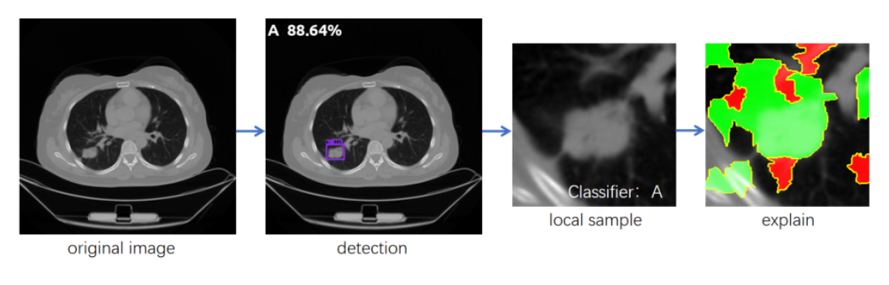
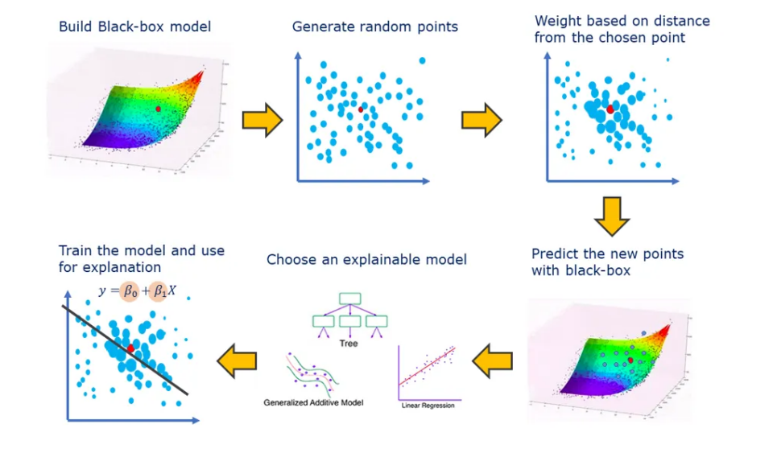
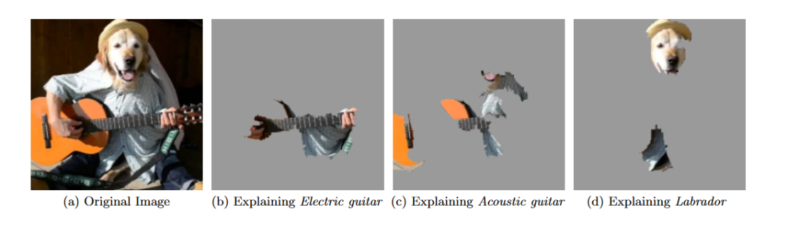
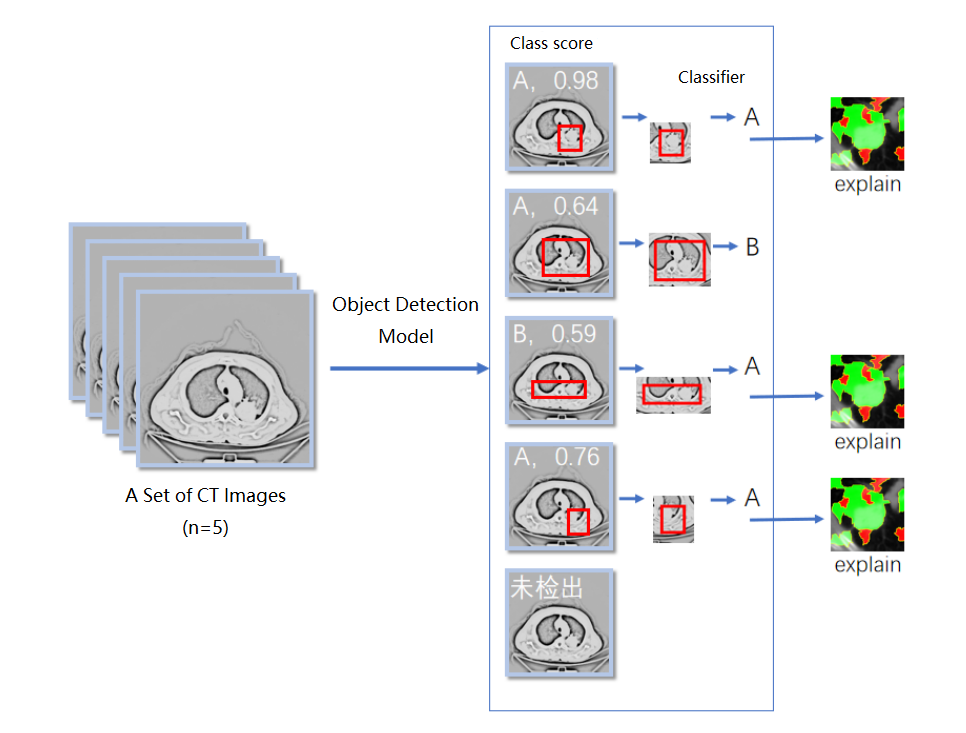
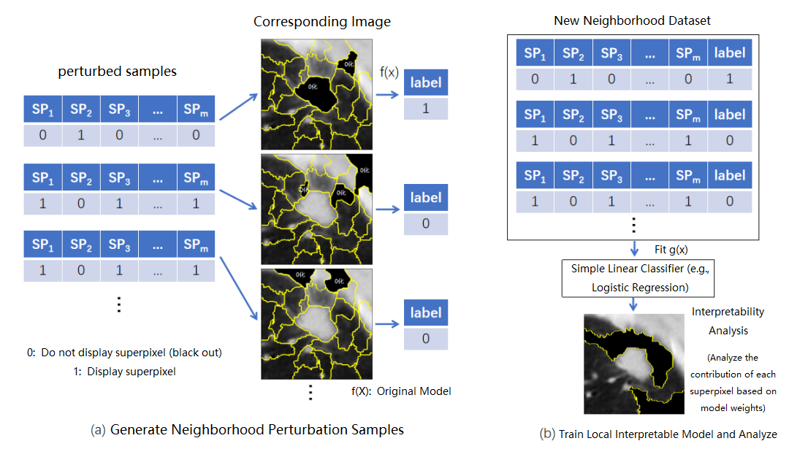
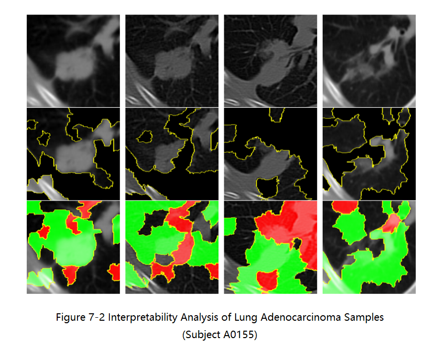
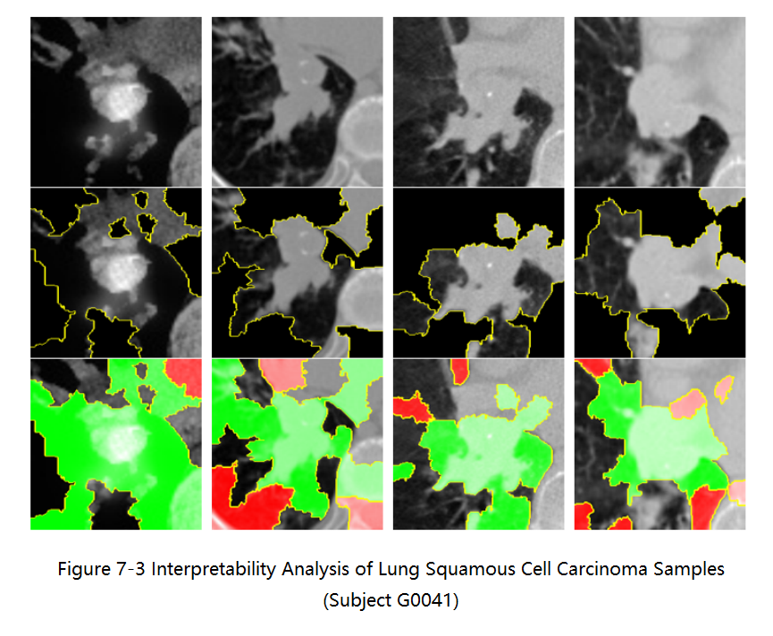
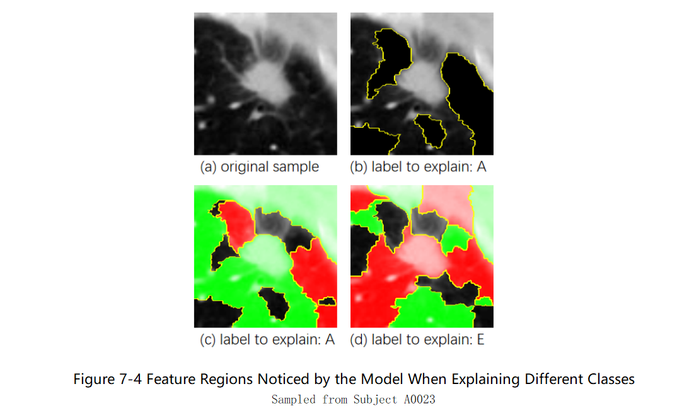

An Explainable AI Demo:

**Intelligent Diagnosis and Interpretability of Lung Cancer from CT Images**

This is my previous work for XAI on lung cancer detection and classification from CT images. If you are interested in this project, please feel free to contact me.

## Table of Contents

- [Table of Contents](#table-of-contents)
- [Abstract](#abstract)
- [Methods](#methods)
  - [1 LIME](#1-lime)
  - [2 Interpretability Analysis of CT Images using LIME](#2-interpretability-analysis-of-ct-images-using-lime)
- [Case Explanation](#case-explanation)
  - [1 Interpretability Analysis of Lung Adenocarcinoma Samples](#1-interpretability-analysis-of-lung-adenocarcinoma-samples)
  - [2 Interpretability Analysis of Lung Squamous Cell Carcinoma Samples](#2-interpretability-analysis-of-lung-squamous-cell-carcinoma-samples)
  - [3 Feature Regions Noticed by the Model When Explaining Different Classes](#3-feature-regions-noticed-by-the-model-when-explaining-different-classes)
- [Reference](#reference)

## Abstract

Early diagnosis is crucial for reducing lung cancer incidence and mortality. While deep learning has shown promise in classifying lung nodules, neural network decisions often lack interpretability. This project addresses lung cancer detection, classification, and interpretability analysis from chest CT images.

Main Contributions:

1. **Detection and Classification**: Using the Lung-PET-CT-Dx dataset, we trained a Retinanet detection model to identify lung lesion patches. Subsequently, lesion patches were classified using ResNet50. We then utilized the LIME algorithm to highlight the critical regions influencing the model’s decisions.
2. **Integrated Interpretability Module**: Innovatively, we integrated a classifier (ResNet50) downstream of the detection network, enabling local lesion-level interpretability. This provides not only preliminary pathological classifications but also insights into model decision-making, enhancing clinical trust and efficiency.
3. **Performance**: The detection accuracy for tumor lesions reached 100%, demonstrating excellent localization. Classification accuracy for Adenocarcinoma (AP=0.507) and Squamous Cell Carcinoma (AP=0.523) reached 100% upon excluding atypical cases such as atelectasis. However, Small Cell Lung Cancer showed lower accuracy (AP=0.241), attributed to its imaging characteristics.
4. **Interpretability**: For typical cases, interpretability analysis accurately highlighted lesion features corresponding to Adenocarcinoma and Squamous Cell Carcinoma classifications. Small Cell Lung Cancer interpretability remained limited, consistent with its clinical imaging complexity.

---

Example: **Workflow for Detection and Interpretability Analysis of a Single CT Image Sample**

## Methods

### 1 LIME

LIME (Local Interpretable Model-agnostic Explanations) is a technique designed to explain the predictions of any machine learning model in an interpretable and faithful manner. It achieves this by approximating the complex model locally with an interpretable one.

### 2 Interpretability Analysis of CT Images using LIME

**The workflow**:

Input a set of CT images, use an Object Detection model (**Retinanet**) to detect lung lesion areas, and crop the corresponding lesion patches. Then, input these patches into a classification model (**ResNet50**) for pathological type classification. Finally, use the **LIME** algorithm to explain the classification results and generate heatmaps to highlight the key areas that the model focuses on.

---

How LIME works in this context:

Generate Local Perturbation Samples and Construct a New Dataset:

## Case Explanation

### 1 Interpretability Analysis of Lung Adenocarcinoma Samples

*Figure 7-2* shows four representative lesion images extracted by the object detector from different slices of subject A0155 in the test set, with each column representing a different slice. The first row displays the original images, which have been normalized using min-max scaling, had extreme dark and bright values removed, and resized to 224×224 pixels. The second row highlights the superpixel regions that positively influence the classification as ***Adenocarcinoma*** (A), with non-influential superpixel regions masked in black. The third row further distinguishes the influence of different superpixel regions on the current classification, where **green areas indicate a positive influence on the current class**, and red areas indicate a negative influence. It can be observed that the model accurately focuses on the relevant areas for classifying the lesion as *Adenocarcinoma*, paying attention not only to the lesion itself but also to its edges and surrounding areas, which aligns with a doctor's reading focus. In cases like the fourth image, where the lesion has an irregular shape, the model can even precisely focus on the effective lesion area and its surrounding image features contributing to the classification.

### 2 Interpretability Analysis of Lung Squamous Cell Carcinoma Samples

*Figure 7-3* presents four representative lesion images from subject G0041 for interpretability analysis, with the first image being a PET-CT scan and the remaining three being plain CT scans. Similar to the previous example, the model accurately focuses on the superpixel regions that positively influence the classification as ***Squamous Cell Carcinoma*** (E), specifically the lesion itself and its edges and surrounding areas.

From the above examples, it is visually evident that *Squamous Cell Carcinoma* and *Adenocarcinoma* exhibit different morphological features, and the model has roughly focused on these areas. Clinically, lung adenocarcinoma often presents with *uneven lesion density* on imaging, with signs such as *spiculation*, *pleural retraction*, and *air bronchograms*; whereas lung squamous cell carcinoma is often a central lesion, commonly found in the *hilar region*, frequently showing connections between the lesion and mediastinal tissue, and may be accompanied by *calcification* (appearing as high-density shadows on CT) and *lobulation* signs. These features can generally be observed in the two subjects presented above.

### 3 Feature Regions Noticed by the Model When Explaining Different Classes

How to confirm that the local interpretable model truly distinguishes between different types of lung cancer? Figure 7-4 shows a lesion image from subject A0023. From images (b) and (c), we can see that the model correctly predicted class A and highlighted the target area of interest. According to the LIME principle, a large number of perturbed samples were generated based on this image, and a simple linear interpretable classifier (such as a logistic regression model) was trained in the local neighborhood. This allows us to analyze the weights for other classes through this model. For example, we can represent the contribution of each superpixel block to class E classification, as shown in (d). It can be seen that for different classes, the local interpretable model provides different weights for each superpixel block. For class E, the model focuses on some irrelevant surrounding tissues while considering the most important lesion area as a negative influence. This indicates that for different classes, the model focuses on different feature areas. For incorrect classifications, the model only focuses on irrelevant features, which also indirectly confirms that the interpretability of sample classification is reasonable.

## Reference

[1] Ribeiro, Marco Tulio, Sameer Singh,  and Carlos Guestrin. "" Why should i trust you?" Explaining the  predictions of any classifier." Proceedings of the 22nd ACM SIGKDD international conference on knowledge discovery and data mining. 2016.

[2] Li, P., Wang, S., Li, T., Lu, J., HuangFu, Y., Wang, D. A Large-Scale CT and PET/CT Dataset for Lung Cancer Diagnosis (Lung-PET-CT-Dx) [Data set]. The Cancer Imaging Archive[EB/OL]. https://doi.org/10.7937/TCIA.2020.NNC2-0461, 2020.
